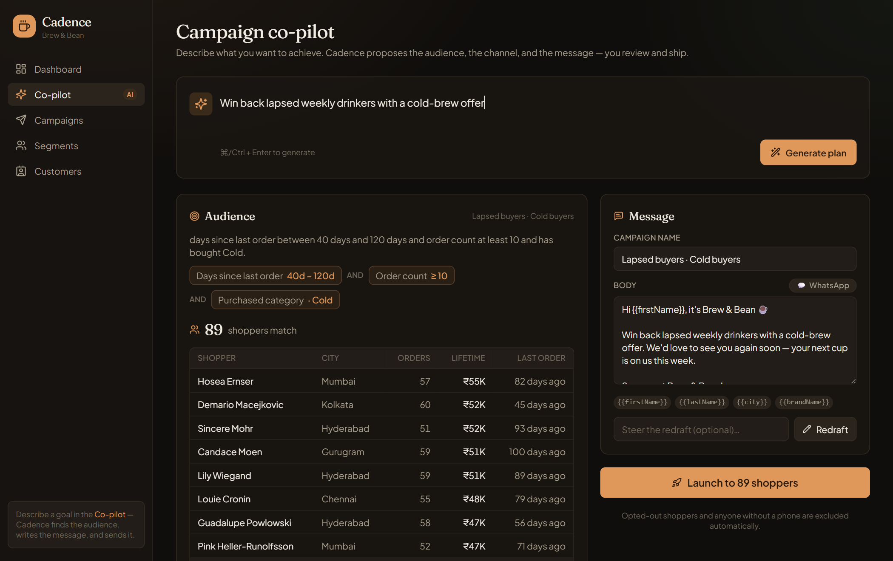
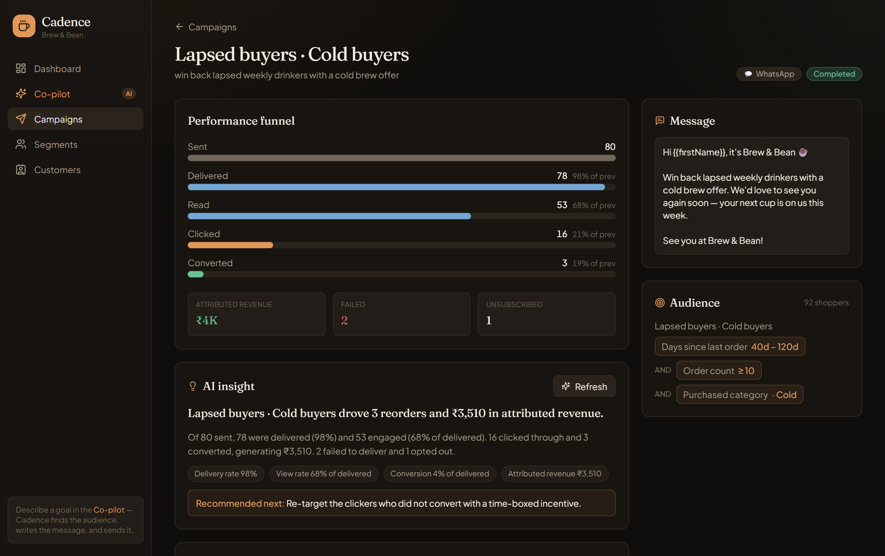

# Cadence

**An AI-native campaign co-pilot for consumer brands.**

> Describe the goal. Cadence finds the audience, writes the message, picks the
> channel, sends it, and tells you what actually worked.

Cadence is a mini CRM  — built for a
D2C / retail marketer who wants to _reach the right shoppers_, not manage a
sales pipeline. You talk to it in plain language ("win back the lapsed weekly
latte drinkers"); it compiles that intent into a **transparent, auditable
audience**, drafts **per-channel personalised messages**, runs the campaign over
a realistic, callback-driven delivery loop, and then **narrates the results**.

The demo brand is a fictional coffee chain, **Brew & Bean** — 480 seeded
shoppers and ~13,000 orders across seven behavioural personas.

---

## The bet — what I chose to build (and what I didn't)

The brief is deliberately open. My opinionated bet: **the hard, valuable part of
reaching shoppers is the decision — _who_ to talk to and _why_ — not the send
button.** So Cadence is an **AI co-pilot with a human always in the loop**: the
AI proposes the audience and the copy, but every decision is shown as **editable,
reviewable structure** — a rule tree, a live "who's in" preview, draft messages —
before anything goes out. No black boxes.

I deliberately **did not** build: multi-tenant auth, a drag-and-drop journey
builder, real provider integrations, or a generic "chat with your data" toy. The
full set of conscious trade-offs and scale assumptions is in
[`ARCHITECTURE.md`](./ARCHITECTURE.md).

---

## A look at it

**The co-pilot** — one goal becomes an editable plan: a transparent audience
(rule chips + a live "who's in" sample), a channel with a reason, and an editable
message.



**The campaign view** — a funnel that fills live as the channel posts receipts
back, plus an on-demand AI read of what worked and what to do next.



---

## How it works

```
        ┌──────────────────────────────────────────────┐
        │                  apps/web                      │
        │     Next.js — UI + CRM API + AI brain          │
        │   co-pilot · segment compiler · receipts ·     │
        │   attribution · insights · Postgres (Prisma)   │
        └───────────────┬───────────────▲────────────────┘
          (1) POST /v1/send              │ (2) POST /api/receipts
              recipient, msg, channel    │  delivered/opened/read/clicked/…
              (Bearer auth)              │  (HMAC-signed, async, out-of-order)
                        ▼                │
        ┌──────────────────────────────────────────────┐
        │              apps/channel-sim                  │
        │   Stubbed channel — simulates each message's   │
        │   lifecycle and reports back asynchronously    │
        └──────────────────────────────────────────────┘
```

**Two services across an async, callback-driven loop** — the core of the brief.
The CRM fires a batch and returns; the channel simulates each message on its own
timers and posts **HMAC-signed receipts** back, **out of order** and **at-least-
once**. The CRM treats receipts as an **append-only event log** and projects
status forward **monotonically**, so a late "delivered" can't clobber a "clicked"
and duplicates are no-ops. The channel is built to misbehave — reorder,
duplicate, fail, retry — because a stub that always succeeds proves nothing.

The full design and the reasoning behind each decision is in
[`ARCHITECTURE.md`](./ARCHITECTURE.md); a video walkthrough script is in
[`DEMO.md`](./DEMO.md).

## AI, woven in

One interface, [`CadenceAi`](./apps/web/src/server/ai/types.ts), at four decision
points: **intent → audience**, **message drafting**, **performance narrative**,
and the **co-pilot** (goal → full campaign). Backed by an **Anthropic** provider
(Claude Sonnet for reasoning, Haiku for drafting) and a **deterministic mock** so
the product runs with zero API keys. The model is **grounded in the shared field
catalogue** so it can't invent a field, forced into a **typed shape via tool-use**,
and **re-validated with zod** — AI output is caught structure, never free text.

---

## Tech stack

TypeScript everywhere · **Next.js 15** (App Router, React 19) · **Tailwind v4** ·
**Prisma + Postgres** · **Express** (channel service) · **Anthropic SDK** ·
**Zod** contracts · npm workspaces monorepo.

```
cadence/
├─ apps/
│  ├─ web/           # Next.js — marketer UI + CRM API + AI brain
│  │  └─ src/server/ # framework-agnostic domain layer (segments, campaigns,
│  │                 #   receipts, attribution, insights, ai)
│  └─ channel-sim/   # standalone service — the stubbed channel + delivery sim
├─ packages/
│  ├─ db/            # Prisma schema, client, persona-driven seed
│  └─ shared/        # Zod contracts: send/receipt loop + the segment rule-tree
├─ Dockerfile · docker-compose.yml · render.yaml · DEPLOY.md
```

---

## Run it locally

### Option A — Docker (one command)

```bash
docker compose up --build
docker compose exec web npm run db:seed     # load the Brew & Bean dataset (once)
```

Open **http://localhost:3000**. (Postgres stays on the internal network, so it
won't clash with anything on 5432. Override `WEB_PORT` / `CHANNEL_PORT` if 3000 /
4000 are taken. Set `ANTHROPIC_API_KEY` in the environment for real AI; otherwise
the free mock runs.)

### Option B — Node + your own Postgres

```bash
npm install
cp .env.example .env                         # then set DATABASE_URL
npm run db:push && npm run db:seed
npm run dev                                  # runs web (:3000) + channel (:4000)
```

Useful scripts: `npm run typecheck` · `npm run db:studio` · `npm run format`.

---

## Deploy

A hosted setup runs on **Vercel** (web) + **Render** (channel) + **Neon**
(Postgres) — all free tiers. Step-by-step, including the two-service wiring, is
in **[`DEPLOY.md`](./DEPLOY.md)**. The repo ships [`render.yaml`](./render.yaml)
and [`apps/web/vercel.json`](./apps/web/vercel.json) for it.

---

## How it was verified

Every layer was checked end-to-end, not just written:

- **Channel loop** — signed receipts validated, idempotent resend, injected
  duplicates absorbed, 401 on bad auth.
- **Segment compiler** — counts matched hand-written SQL exactly against the seed.
- **Full domain + HTTP flow** — co-pilot plan → segment → campaign → launch →
  hundreds of out-of-order, duplicated receipts applied → conversions attributed
  → AI insight, driven through the real HMAC-verified routes.
- **Build** — clean `tsc` across all workspaces, a green Next production build,
  and a working multi-service Docker image.

---

## License

MIT — see [`LICENSE`](./LICENSE).
