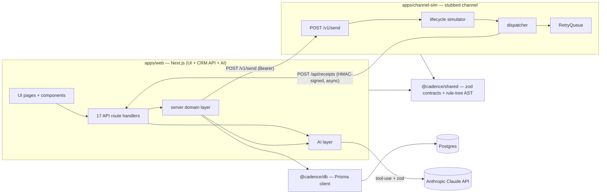
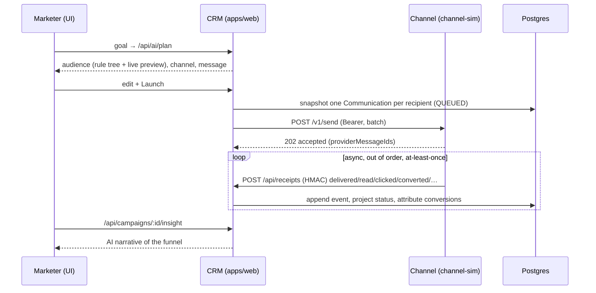

# Cadence — Project Context & Dependency Graph

> Generated snapshot of the **complete project context**: structure, modules,
> dependencies, and the runtime flows. Open [`graph.html`](./graph.html) next to
> this file for the **interactive** version (drag nodes, zoom, hover for detail).

**Cadence** is an AI-native mini CRM — an "AI campaign co-pilot" for a coffee
chain, **Brew & Bean** — built for the Xeno engineering take-home. A marketer
describes a goal in plain language; the product compiles a transparent, editable
**audience**, drafts a **per-channel message**, runs the campaign over a realistic
**two-service, callback-driven delivery loop**, and **narrates the results**.

---

## At a glance

| Metric | Value |
| --- | --- |
| Workspaces | 4 (`@cadence/web`, `@cadence/channel-sim`, `@cadence/db`, `@cadence/shared`) |
| Source files (.ts/.tsx/.prisma) | ~108 |
| Lines of source | ~10,550 |
| HTTP API routes | 17 |
| UI pages | 6 |
| Cross-package imports | `@cadence/shared` ×35 · `@cadence/db` ×15 · `@cadence/shared/server` ×6 |
| Repo | https://github.com/HitanshGithub/Cadence_CRM |

| Area | Files | Lines |
| --- | ---: | ---: |
| `packages/shared/src` (contracts + rule-tree) | 14 | 658 |
| `packages/db` (Prisma schema, client, seed) | 4 | 696 |
| `apps/channel-sim/src` (the stubbed channel) | 9 | 625 |
| `apps/web/src/server` (CRM domain + AI) | 25 | 1,984 |
| `apps/web/src/app` (pages + 17 API routes) | 24 | 1,537 |
| `apps/web/src/components` | 7 | 565 |
| `apps/web/src/lib` (client data layer) | 5 | 265 |

---

## Workspace dependency graph

The two **bold** edges are the core of the brief: the CRM fires a batch and
returns; the channel simulates each message and posts **signed receipts back
asynchronously, out of order and at-least-once**. The CRM applies them to an
append-only event log and projects status forward monotonically.

---

## The request → receipt loop (sequence)

---

## Module map

### `@cadence/shared` — the contract both services + the AI agree on
`enums` · `channels` (per-channel behaviour) · `lifecycle` (monotonic status
projection) · `money` · `templates` · `segment/{fields,schema}` (the rule-tree
AST + field catalogue) · `contracts/{send,receipt}` (the loop's wire types) ·
`security` (HMAC, server-only subpath).

### `@cadence/db` — data
`prisma/schema.prisma` (Brand, Customer w/ RFM rollups, Order/OrderItem, Segment,
Campaign, Communication, CommunicationEvent) · `prisma/seed.ts` (480 persona-driven
customers, ~13k orders) · `src/client.ts` (singleton).

### `apps/channel-sim` — the stubbed channel (Express)
`server` (`/v1/send` Bearer-authed, idempotent) · `simulator` (probabilistic
per-channel lifecycle) · `dispatcher` (schedules events, signs + injects duplicate
receipts) · `queue` (RetryQueue: bounded concurrency, backoff, dead-letter) ·
`store` · `config` · `logger`.

### `apps/web/src/server` — the CRM domain (framework-agnostic)
- **segments/** `compiler` (rule tree → parameterised Prisma query) · `evaluate`
  (count/preview/recipients) · `describe` (rule tree → prose) · `service` (CRUD)
- **campaigns/** `launch` (resolve audience → snapshot comms → dispatch) ·
  `render` · `propensity` · `service`
- **receipts/** `ingest` (idempotent, monotonic projection, attribution)
- **insights/** `stats` (funnel + attributed revenue + dashboard)
- **ai/** `types` (the `CadenceAi` interface) · `anthropic` · `mock` · `prompts`
- `ingestion` · `rollups` · `brand` · `channel/client` · `env` · `http`

### `apps/web/src/app` — HTTP + UI
17 route handlers under `api/` and 6 pages (`/`, `/copilot`, `/campaigns`,
`/campaigns/[id]`, `/segments`, `/customers`), plus `components/` and a client
`lib/` (typed api client + polling hook).

---

## API surface (17 routes)

| Route | Purpose |
| --- | --- |
| `POST /api/ai/plan` | goal → full editable campaign plan (the co-pilot) |
| `POST /api/ai/segment` | NL → audience + live preview |
| `POST /api/ai/draft` | draft/redraft a message |
| `GET·POST /api/segments` · `GET·PATCH·DELETE /api/segments/[id]` · `POST /api/segments/preview` | segment CRUD + live preview |
| `GET·POST /api/campaigns` · `GET·PATCH·DELETE /api/campaigns/[id]` | campaign CRUD + detail |
| `POST /api/campaigns/[id]/launch` · `GET …/stats` · `POST …/insight` | launch, poll funnel, AI insight |
| `POST /api/receipts` | **channel callback** — HMAC-verified receipt ingestion |
| `GET /api/dashboard` · `/meta` · `/customers` · `POST /api/ingest` · `GET /api/health` | dashboard, builder metadata, customers, ingestion, health |

---

## AI layer

One interface, `CadenceAi`, two implementations chosen at runtime by
`resolvedAiProvider()`:
- **Anthropic** — Claude **Sonnet** (reasoning) + **Haiku** (drafting), forced into
  a typed shape via single-tool `tool_choice` and re-validated with zod.
- **Mock** — deterministic heuristics, so the product runs with **no API key**.

The model is grounded in the shared field catalogue (it can't invent a field).
Used at four decision points: `compileSegment`, `draftMessage`,
`summarizePerformance`, `planCampaign`.

---

## Verified end-to-end

Channel loop (signed receipts, idempotent resend, duplicates absorbed, 401 on bad
auth) · segment compiler counts matched hand-written SQL · the full HTTP flow
(plan → segment → campaign → launch → hundreds of out-of-order/duplicated receipts
applied → attributed conversions → AI insight) · clean `tsc` + Next build across
all workspaces · the **multi-service Docker stack** booting in containers with the
channel posting receipts to the web container.

_See [`ARCHITECTURE.md`](../ARCHITECTURE.md) for the reasoning behind each decision._
